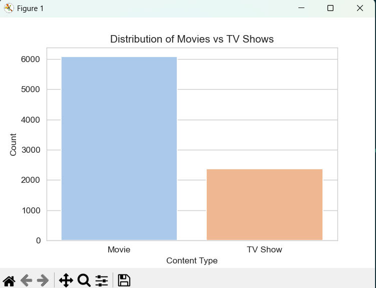
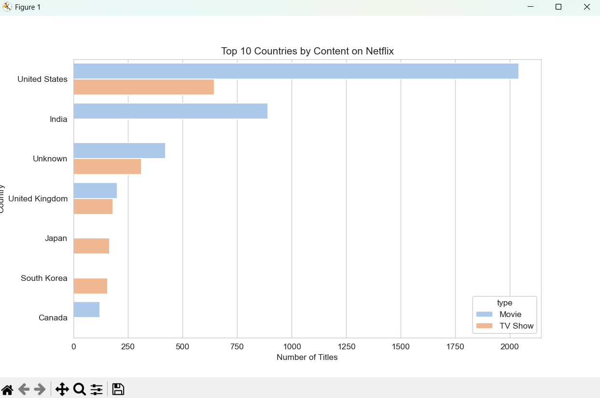
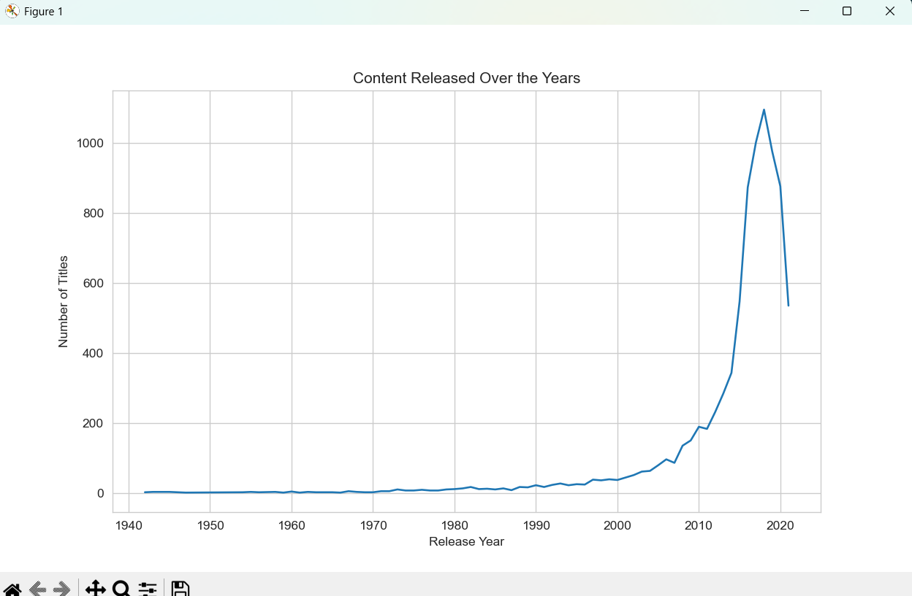

# 📊 Netflix Movies & TV Shows Analysis

## 📌 Overview

This project analyzes the Netflix Movies & TV Shows dataset to uncover insights about content distribution, trends over time, and country-wise production.

The analysis involves **data cleaning, transformation, and visualization** using Python.

---

## 🚀 Key Insights

* 🎬 Movies dominate Netflix content compared to TV Shows
* 🌍 United States and India are the top content-producing countries
* 📈 Significant growth in content after 2015
* 📉 Slight drop observed after peak years

---

## 🛠️ Tech Stack

* Python 🐍
* Pandas
* Matplotlib
* Seaborn

---

## 📂 Dataset

* Netflix Titles Dataset (Kaggle)
* Included in this repository

---

## 🧹 Data Cleaning

* Removed rows with missing `director` and `cast`
* Filled missing values:

  * `country` → "Unknown"
  * `cast` → "Unknown"
  * `rating` → "Unknown"
* Converted `date_added` to datetime format
* Extracted `year_added` column

---

## 📊 Visualizations

### 1️⃣ Distribution of Movies vs TV Shows



---

### 2️⃣ Top 10 Countries by Content on Netflix



---

### 3️⃣ Content Released Over the Years



---

## 📁 Project Structure

```bash
netflix-data-analysis/
│── netflix_titles.csv
│── Netflix.py
│── README.md
│── Images/
│    ├── distribution.png
│    ├── countries.png
│    └── trend.png
```

---

## ▶️ How to Run

```bash
pip install pandas matplotlib seaborn
python Netflix.py
```

---

## 💡 Future Improvements

* Genre-based analysis
* Interactive dashboard (Streamlit / Power BI)
* Recommendation system

---
